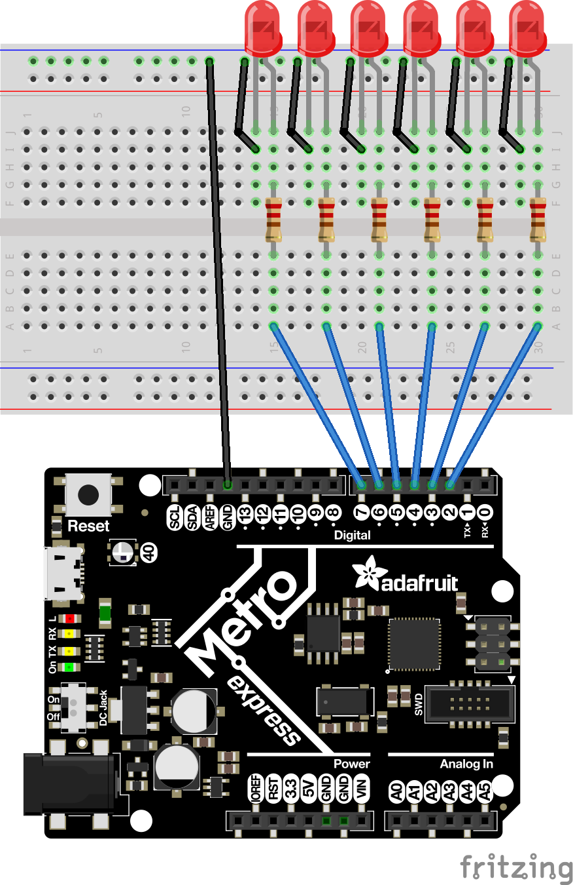

# CircuitPython
My CircuitPython Assignments
# Fade
In this assignment, I made an LED fade in and out using pulseio and duty_cycle.
I also used time.sleep to determine how long the LED takes to get brighter and
how long it stays at it's brightest.
## Fritzing Diagram
>

# Servo
In this assignment, I made a servo rotate back and forth. Eventually, I made it
rotate to one side when I touched a certain wire, and to the other side when I
touched a different wire. I used touchio, pusleio, and duty_cycle.
## Fritzing Diagram
>
# LCD
In this assignment, I had the LCD display how many times a button had been
pressed, and whether it was counting up or down. I had to use three different
variables, and I also used DigitalInOut, Direction, and Pull.DOWN.
## Fritzing Diagram
>
# Photointerrupter
In this assignment, I had my serial moniter count how many times the photointerrupter
had been interrupted. I used two variables as well as DigitalInOut, Direction, and Pull.UP.
## Fritzing Diagram
>
# Distance Sensor
In this assignment, I made the board LED change color depending on the distance
read by the HCSR04. I had to use neopixel, one variable for the distance, and
three variables for the LED (red, green, and blue).
## Fritzing Diagram

# Classes, Objects, and Modules
In this asssignment, I made a chunk of code work by creating my own module. Without creating this module, the code would be rendered useless. The code used RGB LED's and made them glow different colors. The module I made was a class called "RGB".
## Fritzing Diagram

# Hello VS Code
Until this assgignment, I had been using CircuitPython. In this assignment, I learned how to use VS Code and upload code to Git directly from the application (not using GitBash). 
There is not a fritzing diagram for this assignment because I only used the serial moniter.
# FancyLED
For this assignment, I had to used classes, objects and modules again. The goal was to make another chunk of code (that would normally have zero meaning) work. To do that, I had to make my own class. The class was called "FancyLED", and it had four instances called "alternate", "blink", "chase", and "sparkle". These instances of the FancyLED class all did something different with 6 LED's that I had on my breadboard.
## Fritzing Diagram
>

